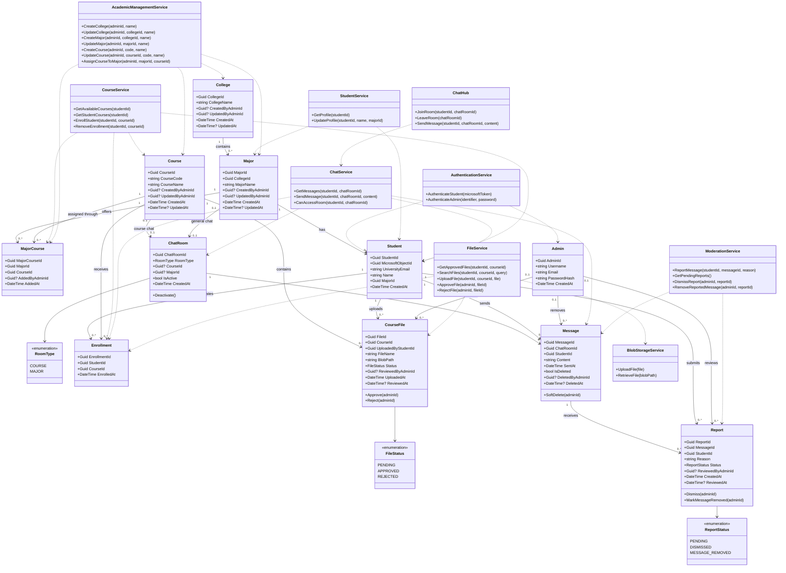

## Class Diagram

View Mermaid source

```mermaid
classDiagram
    class RoomType {
        <<enumeration>>
        COURSE
        MAJOR
    }

    class FileStatus {
        <<enumeration>>
        PENDING
        APPROVED
        REJECTED
    }

    class ReportStatus {
        <<enumeration>>
        PENDING
        DISMISSED
        MESSAGE_REMOVED
    }


    class College {
        +Guid CollegeId
        +string CollegeName
        +Guid? CreatedByAdminId
        +Guid? UpdatedByAdminId
        +DateTime CreatedAt
        +DateTime? UpdatedAt
    }

    class Major {
        +Guid MajorId
        +Guid CollegeId
        +string MajorName
        +Guid? CreatedByAdminId
        +Guid? UpdatedByAdminId
        +DateTime CreatedAt
        +DateTime? UpdatedAt
    }

    class Course {
        +Guid CourseId
        +string CourseCode
        +string CourseName
        +Guid? CreatedByAdminId
        +Guid? UpdatedByAdminId
        +DateTime CreatedAt
        +DateTime? UpdatedAt
    }

    class MajorCourse {
        +Guid MajorCourseId
        +Guid MajorId
        +Guid CourseId
        +Guid? AddedByAdminId
        +DateTime AddedAt
    }

    class Student {
        +Guid StudentId
        +Guid MicrosoftObjectId
        +string UniversityEmail
        +string Name
        +Guid MajorId
        +DateTime CreatedAt
    }

    class Enrollment {
        +Guid EnrollmentId
        +Guid StudentId
        +Guid CourseId
        +DateTime EnrolledAt
    }

    class ChatRoom {
        +Guid ChatRoomId
        +RoomType RoomType
        +Guid? CourseId
        +Guid? MajorId
        +bool IsActive
        +DateTime CreatedAt
        +Deactivate()
    }

    class Message {
        +Guid MessageId
        +Guid ChatRoomId
        +Guid StudentId
        +string Content
        +DateTime SentAt
        +bool IsDeleted
        +Guid? DeletedByAdminId
        +DateTime? DeletedAt
        +SoftDelete(adminId)
    }

    class Report {
        +Guid ReportId
        +Guid MessageId
        +Guid StudentId
        +string Reason
        +ReportStatus Status
        +Guid? ReviewedByAdminId
        +DateTime CreatedAt
        +DateTime? ReviewedAt
        +Dismiss(adminId)
        +MarkMessageRemoved(adminId)
    }

    class CourseFile {
        +Guid FileId
        +Guid CourseId
        +Guid UploadedByStudentId
        +string FileName
        +string BlobPath
        +FileStatus Status
        +Guid? ReviewedByAdminId
        +DateTime UploadedAt
        +DateTime? ReviewedAt
        +Approve(adminId)
        +Reject(adminId)
    }

    class Admin {
        +Guid AdminId
        +string Username
        +string Email
        +string PasswordHash
        +DateTime CreatedAt
    }


    class AuthenticationService {
        +AuthenticateStudent(microsoftToken)
        +AuthenticateAdmin(identifier, password)
    }

    class StudentService {
        +GetProfile(studentId)
        +UpdateProfile(studentId, name, majorId)
    }

    class CourseService {
        +GetAvailableCourses(studentId)
        +GetStudentCourses(studentId)
        +EnrollStudent(studentId, courseId)
        +RemoveEnrollment(studentId, courseId)
    }

    class ChatService {
        +GetMessages(studentId, chatRoomId)
        +SendMessage(studentId, chatRoomId, content)
        +CanAccessRoom(studentId, chatRoomId)
    }

    class ChatHub {
        +JoinRoom(studentId, chatRoomId)
        +LeaveRoom(chatRoomId)
        +SendMessage(studentId, chatRoomId, content)
    }

    class FileService {
        +GetApprovedFiles(studentId, courseId)
        +SearchFiles(studentId, courseId, query)
        +UploadFile(studentId, courseId, file)
        +ApproveFile(adminId, fileId)
        +RejectFile(adminId, fileId)
    }

    class ModerationService {
        +ReportMessage(studentId, messageId, reason)
        +GetPendingReports()
        +DismissReport(adminId, reportId)
        +RemoveReportedMessage(adminId, reportId)
    }

    class AcademicManagementService {
        +CreateCollege(adminId, name)
        +UpdateCollege(adminId, collegeId, name)
        +CreateMajor(adminId, collegeId, name)
        +UpdateMajor(adminId, majorId, name)
        +CreateCourse(adminId, code, name)
        +UpdateCourse(adminId, courseId, code, name)
        +AssignCourseToMajor(adminId, majorId, courseId)
    }

    class BlobStorageService {
        +UploadFile(file)
        +RetrieveFile(blobPath)
    }


    College "1" --> "0..*" Major : contains

    Major "1" --> "0..*" Student : has

    Major "1" --> "0..*" MajorCourse : offers
    Course "1" --> "0..*" MajorCourse : assigned through

    Student "1" --> "0..*" Enrollment : creates
    Course "1" --> "0..*" Enrollment : receives

    Course "0..1" --> "0..1" ChatRoom : course chat
    Major "0..1" --> "0..1" ChatRoom : general chat

    ChatRoom "1" --> "0..*" Message : contains
    Student "1" --> "0..*" Message : sends

    Message "1" --> "0..*" Report : receives
    Student "1" --> "0..*" Report : submits
    Admin "0..1" --> "0..*" Report : reviews

    Course "1" --> "0..*" CourseFile : contains
    Student "1" --> "0..*" CourseFile : uploads
    Admin "0..1" --> "0..*" CourseFile : reviews

    Admin "0..1" --> "0..*" Message : removes


    ChatRoom --> RoomType
    CourseFile --> FileStatus
    Report --> ReportStatus


    AuthenticationService ..> Student
    AuthenticationService ..> Admin

    StudentService ..> Student
    StudentService ..> Major

    CourseService ..> Student
    CourseService ..> Course
    CourseService ..> MajorCourse
    CourseService ..> Enrollment

    ChatHub ..> ChatService
    ChatService ..> ChatRoom
    ChatService ..> Message
    ChatService ..> Enrollment
    ChatService ..> Student

    FileService ..> CourseFile
    FileService ..> Enrollment
    FileService ..> BlobStorageService

    ModerationService ..> Report
    ModerationService ..> Message

    AcademicManagementService ..> College
    AcademicManagementService ..> Major
    AcademicManagementService ..> Course
    AcademicManagementService ..> MajorCourse
```

