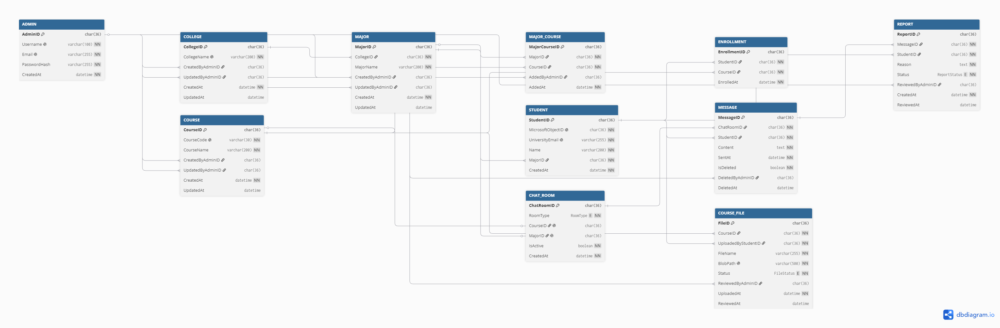

## Database Design



<details>
<summary>View DBML source</summary>

```dbml
Enum RoomType {
  COURSE
  MAJOR
}

Enum FileStatus {
  PENDING
  APPROVED
  REJECTED
}

Enum ReportStatus {
  PENDING
  DISMISSED
  MESSAGE_REMOVED
}


Table ADMIN {
  AdminID char(36) [pk]

  Username varchar(100) [not null, unique]
  Email varchar(255) [not null, unique]
  PasswordHash varchar(255) [not null]

  CreatedAt datetime [not null]
}


Table COLLEGE {
  CollegeID char(36) [pk]

  CollegeName varchar(200) [not null, unique]

  CreatedByAdminID char(36)
  UpdatedByAdminID char(36)

  CreatedAt datetime [not null]
  UpdatedAt datetime
}


Table MAJOR {
  MajorID char(36) [pk]

  CollegeID char(36) [not null]
  MajorName varchar(200) [not null]

  CreatedByAdminID char(36)
  UpdatedByAdminID char(36)

  CreatedAt datetime [not null]
  UpdatedAt datetime

  indexes {
    (CollegeID, MajorName) [unique]
  }
}


Table COURSE {
  CourseID char(36) [pk]

  CourseCode varchar(30) [not null, unique]
  CourseName varchar(200) [not null]

  CreatedByAdminID char(36)
  UpdatedByAdminID char(36)

  CreatedAt datetime [not null]
  UpdatedAt datetime
}


Table MAJOR_COURSE {
  MajorCourseID char(36) [pk]

  MajorID char(36) [not null]
  CourseID char(36) [not null]

  AddedByAdminID char(36)
  AddedAt datetime [not null]

  indexes {
    (MajorID, CourseID) [unique]
  }
}


Table STUDENT {
  StudentID char(36) [pk]

  MicrosoftObjectID char(36) [not null, unique]
  UniversityEmail varchar(255) [not null, unique]
  Name varchar(200) [not null]

  MajorID char(36) [not null]

  CreatedAt datetime [not null]
}


Table ENROLLMENT {
  EnrollmentID char(36) [pk]

  StudentID char(36) [not null]
  CourseID char(36) [not null]

  EnrolledAt datetime [not null]

  indexes {
    (StudentID, CourseID) [unique]
  }
}


Table CHAT_ROOM {
  ChatRoomID char(36) [pk]

  RoomType RoomType [not null]

  CourseID char(36) [unique]
  MajorID char(36) [unique]

  IsActive boolean [not null, default: true]

  CreatedAt datetime [not null]

  checks {
    `(
      (RoomType = 'COURSE' AND CourseID IS NOT NULL AND MajorID IS NULL)
      OR
      (RoomType = 'MAJOR' AND MajorID IS NOT NULL AND CourseID IS NULL)
    )` [name: 'chk_chat_room_owner']
  }
}


Table MESSAGE {
  MessageID char(36) [pk]

  ChatRoomID char(36) [not null]
  StudentID char(36) [not null]

  Content text [not null]
  SentAt datetime [not null]

  IsDeleted boolean [not null, default: false]

  DeletedByAdminID char(36)
  DeletedAt datetime
}


Table REPORT {
  ReportID char(36) [pk]

  MessageID char(36) [not null]
  StudentID char(36) [not null]

  Reason text [not null]
  Status ReportStatus [not null, default: 'PENDING']

  ReviewedByAdminID char(36)

  CreatedAt datetime [not null]
  ReviewedAt datetime

  indexes {
    (StudentID, MessageID) [unique]
  }
}


Table COURSE_FILE {
  FileID char(36) [pk]

  CourseID char(36) [not null]
  UploadedByStudentID char(36) [not null]

  FileName varchar(255) [not null]
  BlobPath varchar(500) [not null, unique]

  Status FileStatus [not null, default: 'PENDING']

  ReviewedByAdminID char(36)

  UploadedAt datetime [not null]
  ReviewedAt datetime
}


Ref: MAJOR.CollegeID > COLLEGE.CollegeID
Ref: STUDENT.MajorID > MAJOR.MajorID


Ref: MAJOR_COURSE.MajorID > MAJOR.MajorID
Ref: MAJOR_COURSE.CourseID > COURSE.CourseID


Ref: ENROLLMENT.StudentID > STUDENT.StudentID
Ref: ENROLLMENT.CourseID > COURSE.CourseID


Ref: COURSE.CourseID ?-? CHAT_ROOM.CourseID
Ref: MAJOR.MajorID ?-? CHAT_ROOM.MajorID


Ref: MESSAGE.ChatRoomID > CHAT_ROOM.ChatRoomID
Ref: MESSAGE.StudentID > STUDENT.StudentID
Ref: MESSAGE.DeletedByAdminID >? ADMIN.AdminID


Ref: REPORT.MessageID > MESSAGE.MessageID
Ref: REPORT.StudentID > STUDENT.StudentID
Ref: REPORT.ReviewedByAdminID >? ADMIN.AdminID


Ref: COURSE_FILE.CourseID > COURSE.CourseID
Ref: COURSE_FILE.UploadedByStudentID > STUDENT.StudentID
Ref: COURSE_FILE.ReviewedByAdminID >? ADMIN.AdminID


Ref: COLLEGE.CreatedByAdminID >? ADMIN.AdminID
Ref: COLLEGE.UpdatedByAdminID >? ADMIN.AdminID

Ref: MAJOR.CreatedByAdminID >? ADMIN.AdminID
Ref: MAJOR.UpdatedByAdminID >? ADMIN.AdminID

Ref: COURSE.CreatedByAdminID >? ADMIN.AdminID
Ref: COURSE.UpdatedByAdminID >? ADMIN.AdminID

Ref: MAJOR_COURSE.AddedByAdminID >? ADMIN.AdminID
```

</details>