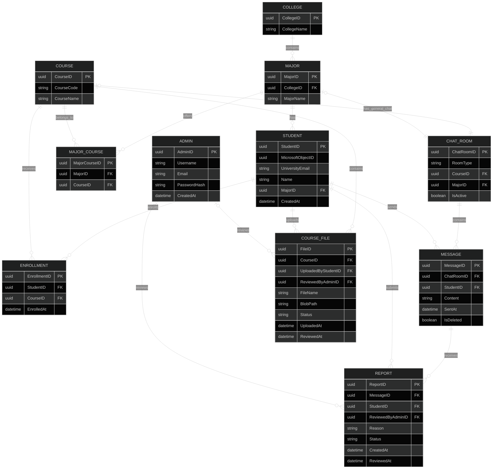

## ER Diagram

View Mermaid source

```mermaid
---
config:
  theme: dark
  fontFamily: '''Recursive Variable'', sans-serif'
  themeVariables:
    fontFamily: '''Recursive Variable'', sans-serif'
---
erDiagram

    COLLEGE {
        uuid CollegeID PK
        string CollegeName
    }

    MAJOR {
        uuid MajorID PK
        uuid CollegeID FK
        string MajorName
    }

    STUDENT {
        uuid StudentID PK
        uuid MicrosoftObjectID
        string UniversityEmail
        string Name
        uuid MajorID FK
        datetime CreatedAt
    }

    COURSE {
        uuid CourseID PK
        string CourseCode
        string CourseName
    }

    MAJOR_COURSE {
        uuid MajorCourseID PK
        uuid MajorID FK
        uuid CourseID FK
    }

    ENROLLMENT {
        uuid EnrollmentID PK
        uuid StudentID FK
        uuid CourseID FK
        datetime EnrolledAt
    }

    CHAT_ROOM {
        uuid ChatRoomID PK
        string RoomType
        uuid CourseID FK
        uuid MajorID FK
        boolean IsActive
    }

    MESSAGE {
        uuid MessageID PK
        uuid ChatRoomID FK
        uuid StudentID FK
        string Content
        datetime SentAt
        boolean IsDeleted
    }

    REPORT {
        uuid ReportID PK
        uuid MessageID FK
        uuid StudentID FK
        uuid ReviewedByAdminID FK
        string Reason
        string Status
        datetime CreatedAt
        datetime ReviewedAt
    }

    COURSE_FILE {
        uuid FileID PK
        uuid CourseID FK
        uuid UploadedByStudentID FK
        uuid ReviewedByAdminID FK
        string FileName
        string BlobPath
        string Status
        datetime UploadedAt
        datetime ReviewedAt
    }

    ADMIN {
        uuid AdminID PK
        string Username
        string Email
        string PasswordHash
        datetime CreatedAt
    }


    COLLEGE ||--o{ MAJOR : contains

    MAJOR ||--o{ STUDENT : has


    MAJOR ||--o{ MAJOR_COURSE : offers
    COURSE ||--o{ MAJOR_COURSE : belongs_to


    STUDENT ||--o{ ENROLLMENT : enrolls
    COURSE ||--o{ ENROLLMENT : receives


    COURSE o|--|| CHAT_ROOM : has_course_chat
    MAJOR o|--|| CHAT_ROOM : has_general_chat


    CHAT_ROOM ||--o{ MESSAGE : contains
    STUDENT ||--o{ MESSAGE : sends


    MESSAGE ||--o{ REPORT : receives
    STUDENT ||--o{ REPORT : submits
    ADMIN o|--o{ REPORT : reviews


    COURSE ||--o{ COURSE_FILE : contains
    STUDENT ||--o{ COURSE_FILE : uploads
    ADMIN o|--o{ COURSE_FILE : reviews
```

