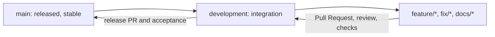
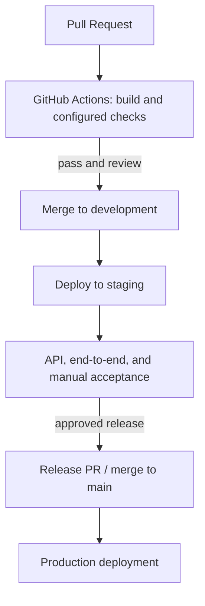

# SCM and QA Strategy

**Project:** Zumrah  
**Team:** SAU-0226-Team 9  
**Scope:** MVP for King Saud University students

## 1. Purpose

This document defines how Zumrah's source code and project changes will be managed, reviewed, tested, and prepared for release. It is a proposed team workflow; the presence of this plan does not imply that its CI/CD jobs or deployment environments are already configured.

The strategy covers the React PWA, Admin Portal, Backend API, MySQL data, SignalR chat, Microsoft OAuth student sign-in, Azure Blob Storage course materials, and project documentation.

## 2. Software Configuration Management

### 2.1 Repository and configuration

Git and GitHub are the project source-control and collaboration tools. Keep the application, database definitions/migrations, API specifications, diagrams, and project documentation in the repository so changes can be reviewed and traced together. Preserve the existing project layout; use clear directories for frontend, admin portal, backend, database, and documentation as the implementation is organized.

Track application configuration templates and non-secret settings in version control. Keep passwords, OAuth secrets, signing keys, database credentials, and storage credentials out of commits; supply them through environment-specific secure configuration.

### 2.2 Branching and merge flow

Use `main` for release-ready code, `development` as the integration branch, and short-lived `feature/*`, `fix/*`, or `docs/*` branches for work. Create branches from `development` and merge changes through a GitHub Pull Request (PR).



Examples: `feature/student-onboarding`, `feature/signalr-chat`, `fix/file-review-status`, `docs/stage-5-scm-qa`.

### 2.3 Commits, pull requests, and review

Make small, focused commits using the Conventional Commits style:

```text
feat: add course enrollment
fix: reject downloads for pending materials
test: cover chat membership authorization
docs: add SCM and QA strategy
```

Every PR should state its purpose, summarize user-visible or data/API changes, link the relevant task when available, and include verification notes. Reviewers check correctness, readability, authorization and validation, error handling, data/API compatibility, and relevant tests/documentation. Require at least one other team member's review and passing applicable checks before merge; resolve review comments before approval. Keep `main` limited to reviewed, accepted releases.

## 3. Quality Assurance Strategy

Test from small units outward, then verify complete student and administrator workflows. Tests should use isolated test data and non-production credentials/services. Record defects with steps to reproduce, expected and actual results, and severity; fix release-blocking defects before acceptance.

| Level | Focus | Zumrah examples |
|---|---|---|
| Unit | Individual business rules and UI logic | Onboarding validation, enrollment eligibility, file review state transitions, API authorization helpers |
| Integration | Components working across service boundaries | Backend API with MySQL; file metadata and Azure Blob operations; Microsoft token validation boundary using test fixtures or a test identity configuration |
| API | Endpoint contracts, status codes, validation, authorization, and error responses | Use Postman collections against a test environment; cover student/admin roles, invalid input, and unauthenticated requests |
| SignalR | Hub connection, authorization, room membership, events, and reconnect behavior | Verify only enrolled/authorized users can join a course chat and receive its messages; verify reconnect and unauthorized access handling |
| End-to-end | High-value user journeys across the PWA, portal, API, and data | Student sign-in/onboarding → browse and enroll → course chat → upload material; administrator sign-in → approve/reject material → student sees/downloads approved file |
| Manual | Usability, responsive behavior, browser/PWA behavior, and exploratory checks | Review key student and administrator flows, installation/offline presentation as implemented, validation messages, and navigation on supported browsers/devices |

The planned testing tools are xUnit for backend unit and integration tests, Vitest with React Testing Library for frontend unit/component tests, Postman for REST API verification, and Playwright for end-to-end testing of critical student and administrator workflows.

### 3.1 File upload and moderation checks

Exercise the complete file lifecycle: upload by an enrolled student, metadata persistence, administrator review, approval or rejection, and student listing/download behavior. Verify that pending and rejected materials are not exposed as approved course resources, approved files are available only to authorized students, and invalid or unsupported uploads receive a clear rejection. Check size/type validation against the limits the implementation defines, prevent unauthorized review actions, and ensure failed storage operations do not leave misleading approved metadata. Do not treat a file as safe based on its name or extension alone.

### 3.2 Acceptance criteria

A change is ready to merge when its PR is reviewed, relevant checks pass, and documentation/configuration examples are updated where needed. A release candidate is acceptable when:

- Required MVP student and administrator stories work against the agreed requirements.
- Authentication and authorization protect student, administrator, API, and chat operations.
- Enrollment, course access, chat membership, and file visibility behave consistently with the user's permissions.
- Uploaded materials follow the pending/approved/rejected moderation flow; only approved materials are downloadable by eligible students.
- No known release-blocking defects remain, and the team has recorded the verification performed.

## 4. CI/CD and release plan

Use GitHub Actions as the planned automation entry point. The workflow should run applicable build and automated checks on PRs to `development` and `main`. After integration, deploy to a staging environment for end-to-end and manual acceptance. Promote an accepted release to production from `main`, with production configuration and credentials kept separate from staging. Deployment steps remain pending implementation and environment setup.



Do not promote when required checks fail or acceptance criteria are unmet. Verify the deployed version and critical flows after each deployment; keep a rollback path appropriate to the chosen hosting and database migration setup.

## 5. Tools

| Tool | Planned use |
|---|---|
| Git | Local version history and branching |
| GitHub | Central repository, Pull Requests, review, and issue/task traceability |
| GitHub Actions | CI checks and the planned staging/production workflow, once configured |
| xUnit | Backend unit and integration testing for ASP.NET/C# |
| Vitest + React Testing Library | React PWA and Admin Portal unit/component testing |
| Postman | REST API request, response, validation, and authorization testing |
| Playwright | End-to-end testing of critical student and administrator workflows |
| MySQL | Application database and isolated integration-test data |
| SignalR | Real-time chat transport tested at hub and user-flow levels |
| Azure Blob Storage | Course-material storage tested through a non-production configuration |
| Microsoft OAuth | Student identity integration, verified with the agreed test setup |
| Mermaid | Version-controlled workflow diagrams in Markdown |
