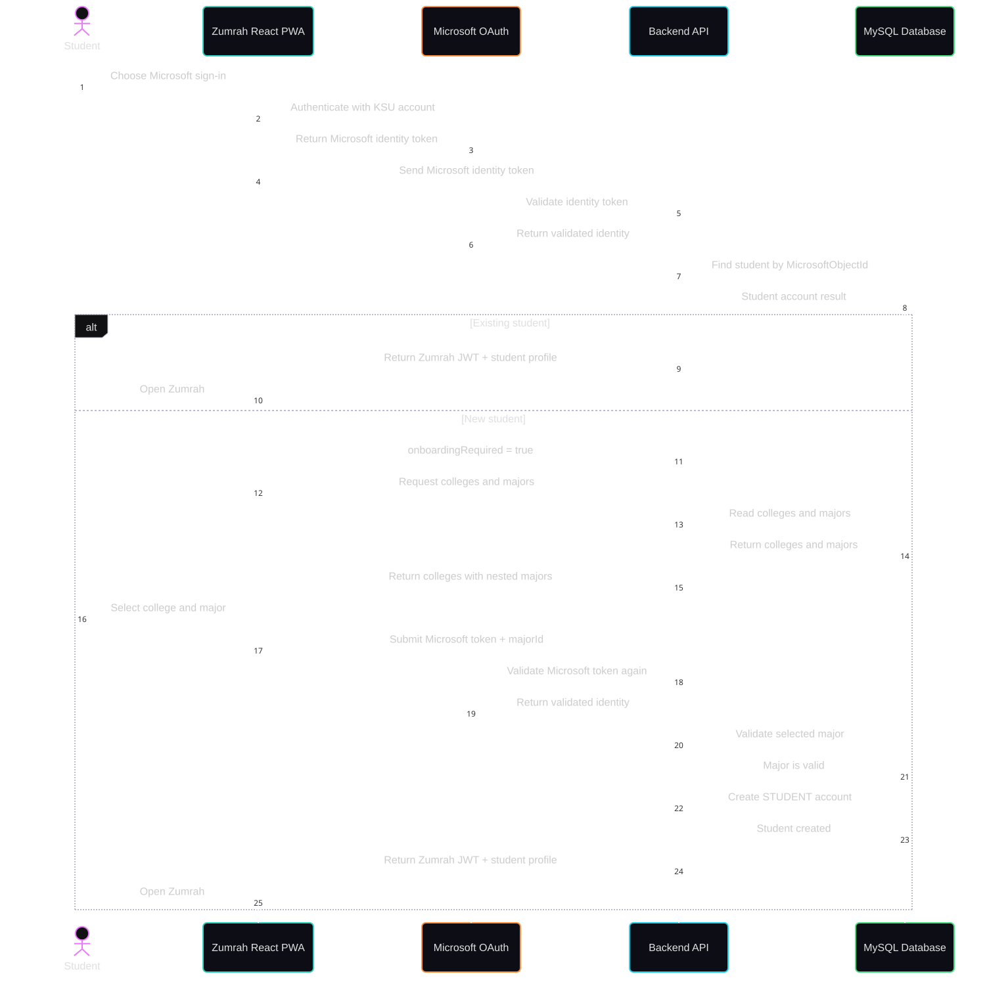
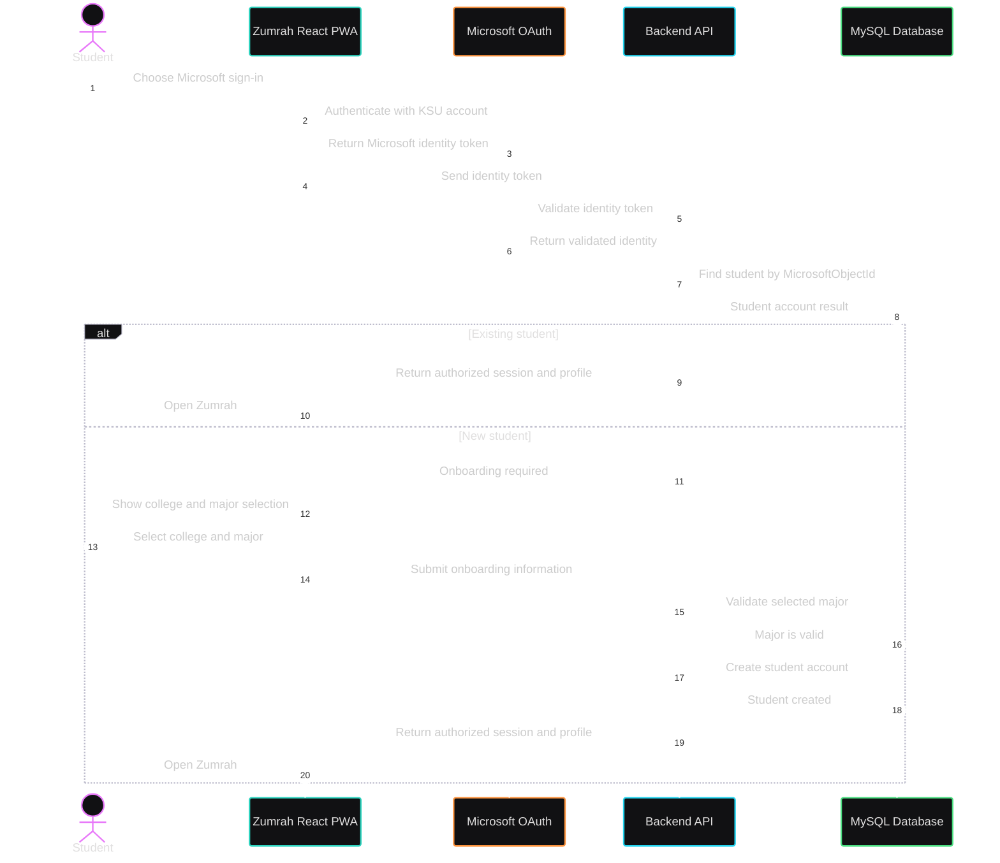
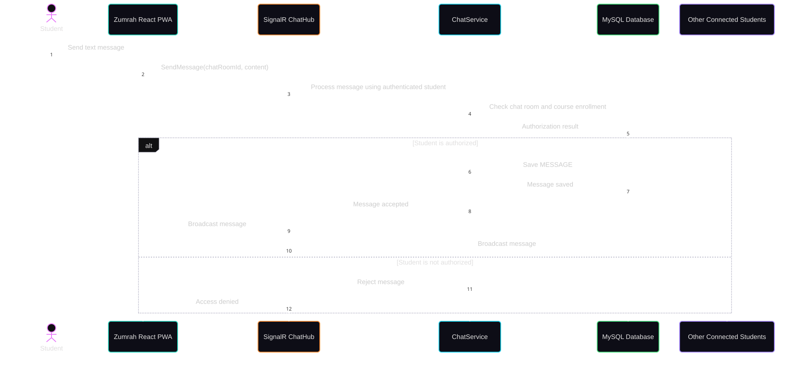
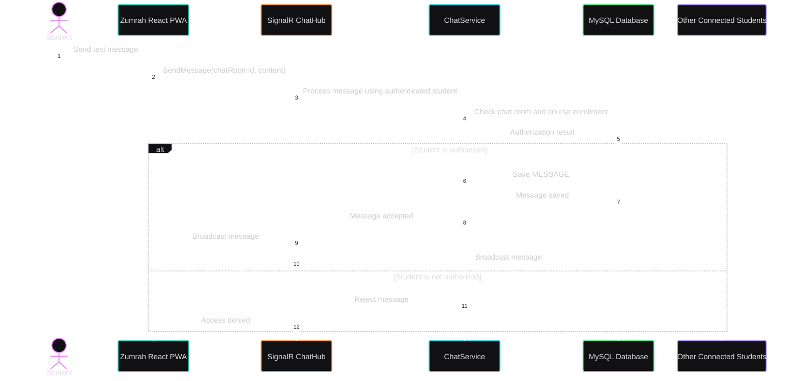
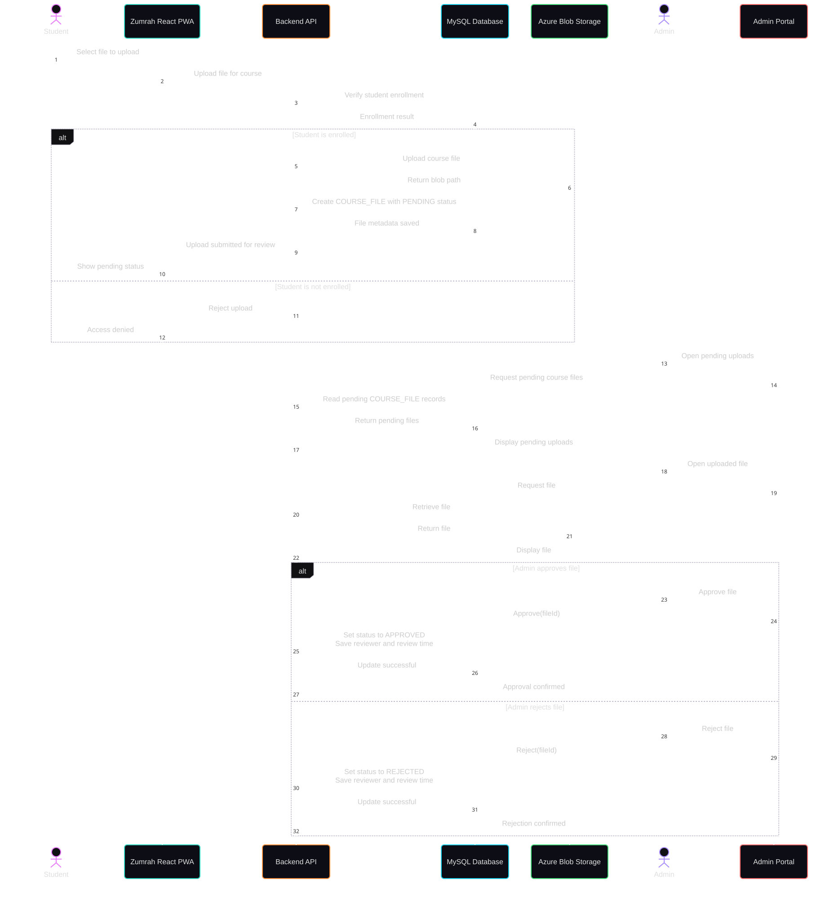
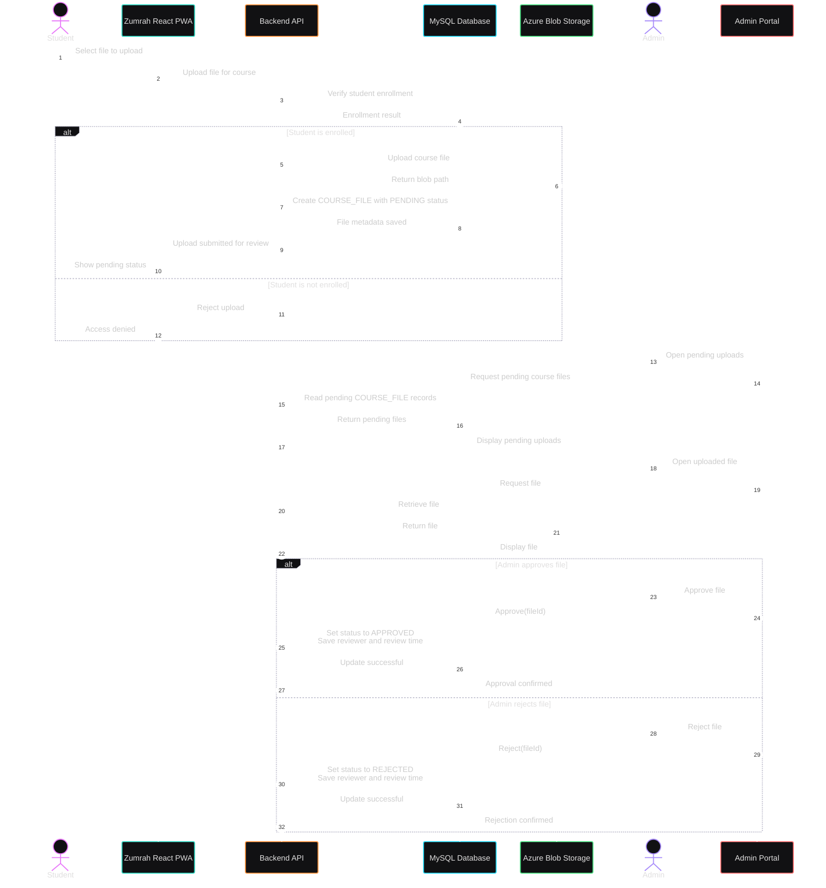

# Sequence Diagrams

## Student Sign-In and Onboarding

View Mermaid source

```mermaid
---
config:
  theme: redux-dark-color
---
sequenceDiagram
    autonumber

    actor Student
    participant PWA as Zumrah React PWA
    participant Microsoft as Microsoft OAuth
    participant API as Backend API
    participant DB as MySQL Database

    Student->>PWA: Choose Microsoft sign-in
    PWA->>Microsoft: Authenticate with KSU account
    Microsoft-->>PWA: Return Microsoft identity token

    PWA->>API: Send identity token
    API->>Microsoft: Validate identity token
    Microsoft-->>API: Return validated identity

    API->>DB: Find student by MicrosoftObjectId
    DB-->>API: Student account result

    alt Existing student
        API-->>PWA: Return authorized session and profile
        PWA-->>Student: Open Zumrah
    else New student
        API-->>PWA: Onboarding required
        PWA-->>Student: Show college and major selection

        Student->>PWA: Select college and major
        PWA->>API: Submit onboarding information

        API->>DB: Validate selected major
        DB-->>API: Major is valid

        API->>DB: Create student account
        DB-->>API: Student created

        API-->>PWA: Return authorized session and profile
        PWA-->>Student: Open Zumrah
    end
```

## Course Chat Message

View Mermaid source

```mermaid
---
config:
  theme: redux-dark-color
---
sequenceDiagram
    autonumber

    actor Student
    participant PWA as Zumrah React PWA
    participant Hub as SignalR ChatHub
    participant Chat as ChatService
    participant DB as MySQL Database
    participant Others as Other Connected Students

    Student->>PWA: Send text message
    PWA->>Hub: SendMessage(chatRoomId, content)

    Hub->>Chat: Process message using authenticated student

    Chat->>DB: Check chat room and course enrollment
    DB-->>Chat: Authorization result

    alt Student is authorized
        Chat->>DB: Save MESSAGE
        DB-->>Chat: Message saved

        Chat-->>Hub: Message accepted
        Hub-->>PWA: Broadcast message
        Hub-->>Others: Broadcast message
    else Student is not authorized
        Chat-->>Hub: Reject message
        Hub-->>PWA: Access denied
    end
```

## Course Material Upload and Review

View Mermaid source

```mermaid
---
config:
  theme: redux-dark-color
---
sequenceDiagram
    autonumber

    actor Student
    participant PWA as Zumrah React PWA
    participant API as Backend API
    participant DB as MySQL Database
    participant Blob as Azure Blob Storage
    actor Admin
    participant AdminPortal as Admin Portal

    Student->>PWA: Select file to upload
    PWA->>API: Upload file for course

    API->>DB: Verify student enrollment
    DB-->>API: Enrollment result

    alt Student is enrolled
        API->>Blob: Upload course file
        Blob-->>API: Return blob path

        API->>DB: Create COURSE_FILE with PENDING status
        DB-->>API: File metadata saved

        API-->>PWA: Upload submitted for review
        PWA-->>Student: Show pending status
    else Student is not enrolled
        API-->>PWA: Reject upload
        PWA-->>Student: Access denied
    end

    Admin->>AdminPortal: Open pending uploads
    AdminPortal->>API: Request pending course files

    API->>DB: Read pending COURSE_FILE records
    DB-->>API: Return pending files
    API-->>AdminPortal: Display pending uploads

    Admin->>AdminPortal: Open uploaded file
    AdminPortal->>API: Request file
    API->>Blob: Retrieve file
    Blob-->>API: Return file
    API-->>AdminPortal: Display file

    alt Admin approves file
        Admin->>AdminPortal: Approve file
        AdminPortal->>API: Approve(fileId)
        API->>DB: Set status to APPROVED<br/>Save reviewer and review time
        DB-->>API: Update successful
        API-->>AdminPortal: Approval confirmed
    else Admin rejects file
        Admin->>AdminPortal: Reject file
        AdminPortal->>API: Reject(fileId)
        API->>DB: Set status to REJECTED<br/>Save reviewer and review time
        DB-->>API: Update successful
        API-->>AdminPortal: Rejection confirmed
    end
```

