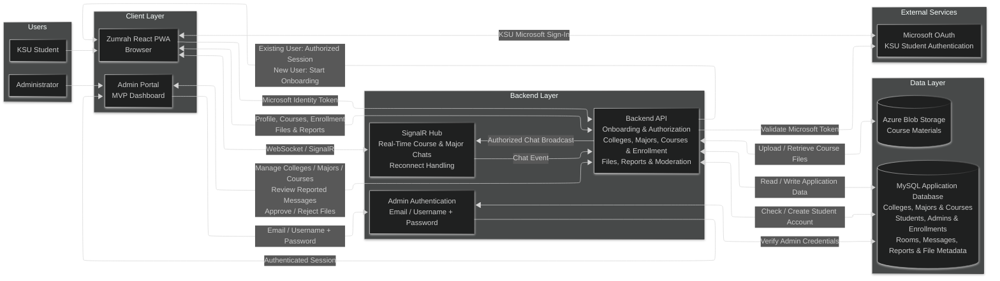
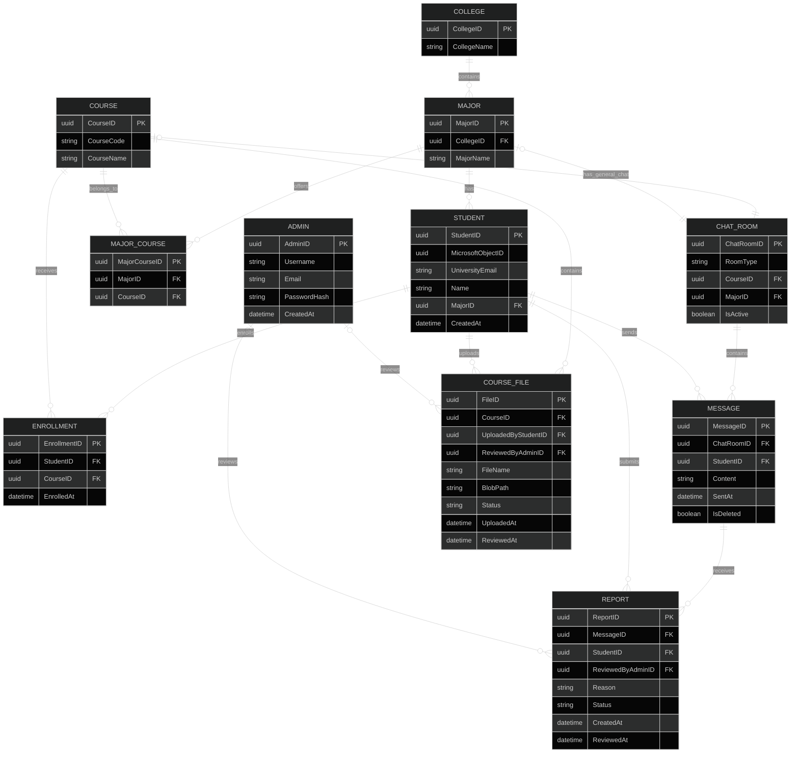
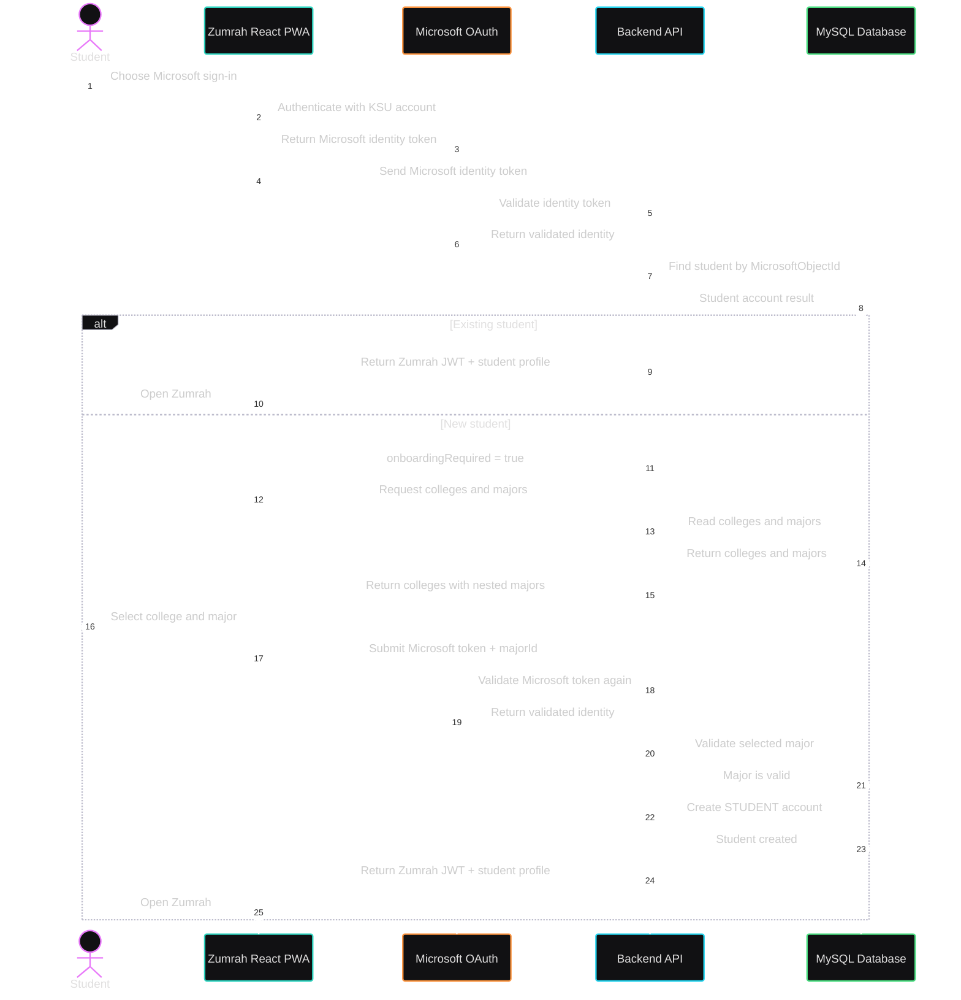
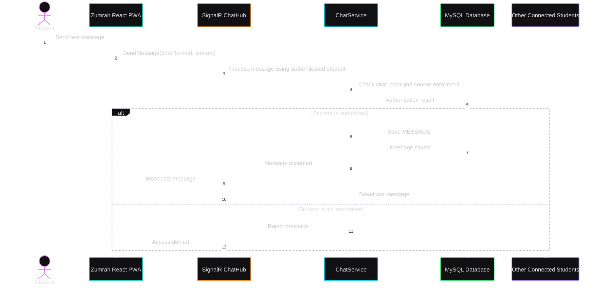
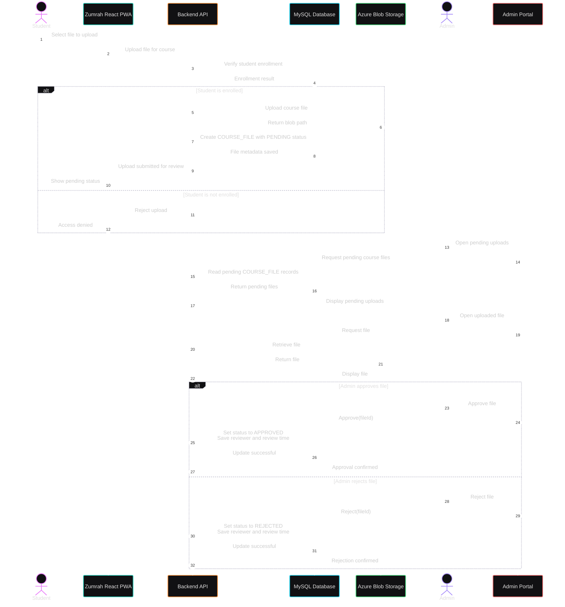
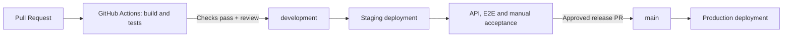

# Zumrah — Stage 3 Technical Documentation

**Project:** Zumrah  
**Team:** SAU-0226-Team 9  
**Members:** Basem Tashkandi, Ali Sayah, Ahmed Alshahrani, Mohammed Aldawsari  
**Scope:** MVP for King Saud University students  

## 1. User Stories and Mockups

**Prioritization:** MoSCoW — **Must** (core MVP), **Should** (useful but not essential), **Could** (optional), **Won't** (excluded from this MVP).

### 1.1 Must Have — Student

| ID | User story |
|---|---|
| US-01 | As a KSU student, I want to sign in using my university account so I can access Zumrah. |
| US-02 | As a new student, I want to create a Zumrah account using my university account. |
| US-03 | As a new student, I want to choose my college and major to see relevant courses and community. |
| US-04 | As a student, I want to browse courses offered to my major. |
| US-05 | As a student, I want to enroll in a course to access its chat and approved materials. |
| US-06 | As a student, I want to leave a course I am no longer taking. |
| US-07 | As a student, I want to view my enrolled courses for quick access. |
| US-08 | As a student, I want to access my major's general community to communicate with peers. |
| US-09 | As a student, I want to access the chat of a course I joined. |
| US-10 | As a student, I want to send text messages in communities I can access. |
| US-11 | As a student, I want to view approved materials for courses I joined. |
| US-12 | As a student, I want to download approved course materials for studying. |
| US-13 | As a student, I want to upload materials to joined courses for sharing after admin approval. |
| US-14 | As a student, I want to report inappropriate messages for administrator review. |
| US-15 | As a student, I want to install Zumrah on my home screen for convenient access. |

### 1.2 Must Have — Administrator

| ID | Concise user story |
|---|---|
| US-16 | As an admin, I want to sign in to the Admin Portal to manage and moderate Zumrah. |
| US-17 | As an admin, I want to manage colleges to keep academic information accurate. |
| US-18 | As an admin, I want to manage majors within colleges for accurate onboarding. |
| US-19 | As an admin, I want to manage courses to maintain the course catalog. |
| US-20 | As an admin, I want to assign courses to majors so students see relevant offerings. |
| US-21 | As an admin, I want to review student-uploaded materials for appropriateness. |
| US-22 | As an admin, I want to approve or reject materials so only approved resources are shared. |
| US-23 | As an admin, I want to review reported messages and report details. |
| US-24 | As an admin, I want to dismiss reports that require no action. |
| US-25 | As an admin, I want to remove messages that violate platform rules. |

### 1.3 Should Have

| ID | Concise user story |
|---|---|
| US-26 | As a student, I want to view my profile to confirm my personal and academic information. |
| US-27 | As a student, I want to search course materials by filename to find resources quickly. |

### 1.4 Could Have — None currently planned.

### 1.5 Won't Have — Current MVP

| ID | Concise user story |
|---|---|
| WH-01 | As a student, I want to reply directly to a message to respond to a specific point. |
| WH-02 | As a student, I want to react to messages without sending another message. |
| WH-03 | As a student, I want to attach files or images directly to chat messages. |
| WH-04 | As a student, I want to edit a sent message to correct mistakes. |
| WH-05 | As a student, I want a native iOS or Android application. |
| WH-06 | As a teacher or tutor, I want a dedicated account role to interact with students. |
| WH-07 | As a student, I want courses filtered by my academic level. |

### 1.4 Mockups

Student-facing Figma mockups include **sign-in, account creation, college/major onboarding, course registration, community/chat, course materials, and material upload**. The Admin Portal is kept simple and functional for the MVP focusing on management and moderation needs rather than detailed visual design.


---

## 2. System Architecture



<details>
<summary>View Mermaid source</summary>



</details>

---

## 3. Components, Classes, and Database Design

### 3.1 ER Diagram


<details>
<summary>View Mermaid source</summary>



</details>


### 3.2 Database Schema


<details>
<summary>View DBML source</summary>

```dbml
Enum RoomType {
  COURSE
  MAJOR
}

Enum FileStatus {
  PENDING
  APPROVED
  REJECTED
}

Enum ReportStatus {
  PENDING
  DISMISSED
  MESSAGE_REMOVED
}


Table ADMIN {
  AdminID char(36) [pk]

  Username varchar(100) [not null, unique]
  Email varchar(255) [not null, unique]
  PasswordHash varchar(255) [not null]

  CreatedAt datetime [not null]
}


Table COLLEGE {
  CollegeID char(36) [pk]

  CollegeName varchar(200) [not null, unique]

  CreatedByAdminID char(36)
  UpdatedByAdminID char(36)

  CreatedAt datetime [not null]
  UpdatedAt datetime
}


Table MAJOR {
  MajorID char(36) [pk]

  CollegeID char(36) [not null]
  MajorName varchar(200) [not null]

  CreatedByAdminID char(36)
  UpdatedByAdminID char(36)

  CreatedAt datetime [not null]
  UpdatedAt datetime

  indexes {
    (CollegeID, MajorName) [unique]
  }
}


Table COURSE {
  CourseID char(36) [pk]

  CourseCode varchar(30) [not null, unique]
  CourseName varchar(200) [not null]

  CreatedByAdminID char(36)
  UpdatedByAdminID char(36)

  CreatedAt datetime [not null]
  UpdatedAt datetime
}


Table MAJOR_COURSE {
  MajorCourseID char(36) [pk]

  MajorID char(36) [not null]
  CourseID char(36) [not null]

  AddedByAdminID char(36)
  AddedAt datetime [not null]

  indexes {
    (MajorID, CourseID) [unique]
  }
}


Table STUDENT {
  StudentID char(36) [pk]

  MicrosoftObjectID char(36) [not null, unique]
  UniversityEmail varchar(255) [not null, unique]
  Name varchar(200) [not null]

  MajorID char(36) [not null]

  CreatedAt datetime [not null]
}


Table ENROLLMENT {
  EnrollmentID char(36) [pk]

  StudentID char(36) [not null]
  CourseID char(36) [not null]

  EnrolledAt datetime [not null]

  indexes {
    (StudentID, CourseID) [unique]
  }
}


Table CHAT_ROOM {
  ChatRoomID char(36) [pk]

  RoomType RoomType [not null]

  CourseID char(36) [unique]
  MajorID char(36) [unique]

  IsActive boolean [not null, default: true]

  CreatedAt datetime [not null]

  checks {
    `(
      (RoomType = 'COURSE' AND CourseID IS NOT NULL AND MajorID IS NULL)
      OR
      (RoomType = 'MAJOR' AND MajorID IS NOT NULL AND CourseID IS NULL)
    )` [name: 'chk_chat_room_owner']
  }
}


Table MESSAGE {
  MessageID char(36) [pk]

  ChatRoomID char(36) [not null]
  StudentID char(36) [not null]

  Content text [not null]
  SentAt datetime [not null]

  IsDeleted boolean [not null, default: false]

  DeletedByAdminID char(36)
  DeletedAt datetime
}


Table REPORT {
  ReportID char(36) [pk]

  MessageID char(36) [not null]
  StudentID char(36) [not null]

  Reason text [not null]
  Status ReportStatus [not null, default: 'PENDING']

  ReviewedByAdminID char(36)

  CreatedAt datetime [not null]
  ReviewedAt datetime

  indexes {
    (StudentID, MessageID) [unique]
  }
}


Table COURSE_FILE {
  FileID char(36) [pk]

  CourseID char(36) [not null]
  UploadedByStudentID char(36) [not null]

  FileName varchar(255) [not null]
  BlobPath varchar(500) [not null, unique]

  Status FileStatus [not null, default: 'PENDING']

  ReviewedByAdminID char(36)

  UploadedAt datetime [not null]
  ReviewedAt datetime
}


Ref: MAJOR.CollegeID > COLLEGE.CollegeID
Ref: STUDENT.MajorID > MAJOR.MajorID


Ref: MAJOR_COURSE.MajorID > MAJOR.MajorID
Ref: MAJOR_COURSE.CourseID > COURSE.CourseID


Ref: ENROLLMENT.StudentID > STUDENT.StudentID
Ref: ENROLLMENT.CourseID > COURSE.CourseID


Ref: COURSE.CourseID ?-? CHAT_ROOM.CourseID
Ref: MAJOR.MajorID ?-? CHAT_ROOM.MajorID


Ref: MESSAGE.ChatRoomID > CHAT_ROOM.ChatRoomID
Ref: MESSAGE.StudentID > STUDENT.StudentID
Ref: MESSAGE.DeletedByAdminID >? ADMIN.AdminID


Ref: REPORT.MessageID > MESSAGE.MessageID
Ref: REPORT.StudentID > STUDENT.StudentID
Ref: REPORT.ReviewedByAdminID >? ADMIN.AdminID


Ref: COURSE_FILE.CourseID > COURSE.CourseID
Ref: COURSE_FILE.UploadedByStudentID > STUDENT.StudentID
Ref: COURSE_FILE.ReviewedByAdminID >? ADMIN.AdminID


Ref: COLLEGE.CreatedByAdminID >? ADMIN.AdminID
Ref: COLLEGE.UpdatedByAdminID >? ADMIN.AdminID

Ref: MAJOR.CreatedByAdminID >? ADMIN.AdminID
Ref: MAJOR.UpdatedByAdminID >? ADMIN.AdminID

Ref: COURSE.CreatedByAdminID >? ADMIN.AdminID
Ref: COURSE.UpdatedByAdminID >? ADMIN.AdminID

Ref: MAJOR_COURSE.AddedByAdminID >? ADMIN.AdminID
```

</details>

### 3.3 Class Diagram

```mermaid
classDiagram

    class RoomType {
        <<enumeration>>
        COURSE
        MAJOR
    }

    class FileStatus {
        <<enumeration>>
        PENDING
        APPROVED
        REJECTED
    }

    class ReportStatus {
        <<enumeration>>
        PENDING
        DISMISSED
        MESSAGE_REMOVED
    }


    class College {
        +Guid CollegeId
        +string CollegeName
        +Guid? CreatedByAdminId
        +Guid? UpdatedByAdminId
        +DateTime CreatedAt
        +DateTime? UpdatedAt
    }

    class Major {
        +Guid MajorId
        +Guid CollegeId
        +string MajorName
        +Guid? CreatedByAdminId
        +Guid? UpdatedByAdminId
        +DateTime CreatedAt
        +DateTime? UpdatedAt
    }

    class Course {
        +Guid CourseId
        +string CourseCode
        +string CourseName
        +Guid? CreatedByAdminId
        +Guid? UpdatedByAdminId
        +DateTime CreatedAt
        +DateTime? UpdatedAt
    }

    class MajorCourse {
        +Guid MajorCourseId
        +Guid MajorId
        +Guid CourseId
        +Guid? AddedByAdminId
        +DateTime AddedAt
    }

    class Student {
        +Guid StudentId
        +Guid MicrosoftObjectId
        +string UniversityEmail
        +string Name
        +Guid MajorId
        +DateTime CreatedAt
    }

    class Enrollment {
        +Guid EnrollmentId
        +Guid StudentId
        +Guid CourseId
        +DateTime EnrolledAt
    }

    class ChatRoom {
        +Guid ChatRoomId
        +RoomType RoomType
        +Guid? CourseId
        +Guid? MajorId
        +bool IsActive
        +DateTime CreatedAt
    }

    class Message {
        +Guid MessageId
        +Guid ChatRoomId
        +Guid StudentId
        +string Content
        +DateTime SentAt
        +bool IsDeleted
        +Guid? DeletedByAdminId
        +DateTime? DeletedAt
        +SoftDelete(adminId)
    }

    class Report {
        +Guid ReportId
        +Guid MessageId
        +Guid StudentId
        +string Reason
        +ReportStatus Status
        +Guid? ReviewedByAdminId
        +DateTime CreatedAt
        +DateTime? ReviewedAt
        +Dismiss(adminId)
        +MarkMessageRemoved(adminId)
    }

    class CourseFile {
        +Guid FileId
        +Guid CourseId
        +Guid UploadedByStudentId
        +string FileName
        +string BlobPath
        +FileStatus Status
        +Guid? ReviewedByAdminId
        +DateTime UploadedAt
        +DateTime? ReviewedAt
        +Approve(adminId)
        +Reject(adminId)
    }

    class Admin {
        +Guid AdminId
        +string Username
        +string Email
        +string PasswordHash
        +DateTime CreatedAt
    }


    class StudentAuthenticationService {
        +AuthenticateStudent(microsoftToken)
    }

    class AdminAuthenticationService {
        +AuthenticateAdmin(identifier, password)
    }


    class StudentService {
        +GetProfile(studentId)
        +CompleteOnboarding(microsoftObjectId, universityEmail, name, majorId)
        +UpdateProfile(studentId, name, majorId)
        -RemoveIncompatibleEnrollments(studentId, majorId)
    }

    class CourseService {
        +GetAvailableCourses(studentId)
        +GetStudentCourses(studentId)
        +EnrollStudent(studentId, courseId)
        +RemoveEnrollment(studentId, courseId)
    }

    class ChatService {
        +GetMessages(studentId, chatRoomId)
        +SendMessage(studentId, chatRoomId, content)
        +CanAccessRoom(studentId, chatRoomId)
    }

    class ChatHub {
        +JoinRoom(chatRoomId)
        +LeaveRoom(chatRoomId)
        +SendMessage(chatRoomId, content)
    }

    class FileService {
        +GetApprovedFiles(studentId, courseId)
        +SearchApprovedFiles(studentId, courseId, query)
        +DownloadFile(studentId, fileId)
        +UploadFile(studentId, courseId, file)
        +ApproveFile(adminId, fileId)
        +RejectFile(adminId, fileId)
    }

    class ModerationService {
        +ReportMessage(studentId, messageId, reason)
        +GetPendingReports()
        +DismissReport(adminId, reportId)
        +RemoveReportedMessage(adminId, reportId)
    }

    class AcademicManagementService {
        +CreateCollege(adminId, name)
        +UpdateCollege(adminId, collegeId, name)
        +CreateMajor(adminId, collegeId, name)
        +UpdateMajor(adminId, majorId, name)
        +CreateCourse(adminId, code, name)
        +UpdateCourse(adminId, courseId, code, name)
        +AssignCourseToMajor(adminId, majorId, courseId)
    }


    class BlobStorageService {
        +UploadFile(file)
        +RetrieveFile(blobPath)
    }


    College "1" --> "0..*" Major : contains

    Major "1" --> "0..*" Student : has

    Major "1" --> "0..*" MajorCourse : offers
    Course "1" --> "0..*" MajorCourse : assigned through

    Student "1" --> "0..*" Enrollment : creates
    Course "1" --> "0..*" Enrollment : receives

    Course "0..1" --> "1" ChatRoom : owns course chat
    Major "0..1" --> "1" ChatRoom : owns general chat

    ChatRoom "1" --> "0..*" Message : contains
    Student "1" --> "0..*" Message : sends

    Message "1" --> "0..*" Report : receives
    Student "1" --> "0..*" Report : submits
    Admin "0..1" --> "0..*" Report : reviews

    Course "1" --> "0..*" CourseFile : contains
    Student "1" --> "0..*" CourseFile : uploads
    Admin "0..1" --> "0..*" CourseFile : reviews

    Admin "0..1" --> "0..*" Message : removes


    ChatRoom ..> RoomType : uses
    CourseFile ..> FileStatus : uses
    Report ..> ReportStatus : uses


    StudentAuthenticationService ..> Student

    AdminAuthenticationService ..> Admin

    StudentService ..> Student
    StudentService ..> Major
    StudentService ..> Enrollment
    StudentService ..> MajorCourse

    CourseService ..> Student
    CourseService ..> Course
    CourseService ..> MajorCourse
    CourseService ..> Enrollment

    ChatHub ..> ChatService

    ChatService ..> ChatRoom
    ChatService ..> Message
    ChatService ..> Enrollment
    ChatService ..> Student

    FileService ..> CourseFile
    FileService ..> Enrollment
    FileService ..> BlobStorageService

    ModerationService ..> Report
    ModerationService ..> Message

    AcademicManagementService ..> College
    AcademicManagementService ..> Major
    AcademicManagementService ..> Course
    AcademicManagementService ..> MajorCourse
    AcademicManagementService ..> ChatRoom


    note for ChatRoom "Exactly one owner must exist: CourseId OR MajorId, never both."

    note for StudentService "If MajorId changes, enrollments unavailable to the new major are automatically removed."

    note for AcademicManagementService "Creating a Major creates its general chat room. Creating a Course creates its course chat room."
```



<details>
<summary>View Mermaid source</summary>



</details>

---

## 4. High-Level Sequence Diagrams

### Student Sign-In and Onboarding


<details>
<summary>View Mermaid source</summary>



</details>


### Course Chat Message


<details>
<summary>View Mermaid source</summary>



</details>


### Course Material Upload and Review


<details>
<summary>View Mermaid source</summary>


</details>


## 5. External and Internal API Specifications

### 5.1 External APIs and services

| External service | Integration and purpose | Why chosen |
|---|---|---|
| **Microsoft Authentication** | The React PWA gets a **Microsoft access token for the Zumrah API** after a student signs in with their university account, the backend checks the token to see if the person is an existing KSU student or needs to finish onboarding. | Reuses student university identity without storing separate student passwords. |
| **Azure Blob Storage** | The backend uploads/retrieves course material files, MySQL stores file metadata and the blob path. | Azure Blob Storage is more suitable for storing files than storing them directly in a relational database like MySQL. |


### 5.2 API conventions


- **REST base:** `/api` · **Real-time SignalR hub:** `/hubs/chat`.

- Requests/responses use **JSON**, except file uploads (`multipart/form-data`) and downloads (binary file response).

- IDs are **UUIDs**, timestamps are **ISO 8601 UTC**. URL placeholders such as `{courseId}` are path parameters.

- Protected calls use `Authorization: Bearer <zumrah-jwt>`, student/admin identity comes from the authenticated token, **not** a client-supplied ID. The authentication and college-reference endpoints require no Zumrah JWT, onboarding requires a valid Microsoft access token.

- **Status codes:** `200` success, `201` created, `204` no body, `400` invalid input, `401` unauthenticated, `403` forbidden, `404` not found, `409` conflict.

- **Error body:** `{"code":"COURSE_ACCESS_DENIED","message":"You do not have access to this course."}`.


**Reading the API tables:** Each input and output cell shows an explicit example of the JSON sent or returned. Values (IDs, names, tokens and timestamps) are illustrative; arrays show one representative item. A `204 No Content` response has no body.


### 5.3 Authentication endpoints

| Name | Method | URL path | Input | Successful output | Access |
|---|---|---|---|---|---|
| Authenticate Student | `POST` | `/api/auth/student` | `{"microsoftToken":"<microsoft-access-token>"}` | **200 (existing):** `{"onboardingRequired":false,"accessToken":"<zumrah-jwt>","student":{"studentId":"247c3afb-f2eb-4a35-85cd-018be08ae76b","name":"Ahmed Ali","universityEmail":"ahmed@student.ksu.edu.sa","college":{"collegeId":"21af367d-40c7-4d2b-b714-d3447726b4eb","collegeName":"College of Computer and Information Sciences"},"major":{"majorId":"61446afc-660e-4eb2-aa0a-626ae522189d","majorName":"Computer Science"},"majorChatRoomId":"123fcdda-714e-42a7-849f-fcad49786258"}}`<br>**200 (new):** `{"onboardingRequired":true}` | Public |
| Authenticate Administrator | `POST` | `/api/auth/admin` | `{"identifier":"zumrah-admin","password":"<password>"}` | **200:** `{"accessToken":"<zumrah-admin-jwt>","admin":{"adminId":"0854ad8a-5f4c-4d63-b88b-9c75bc750aa5","username":"zumrah-admin","email":"admin@zumrah.local"}}` | Public |
| Complete Student Onboarding | `POST` | `/api/onboarding` | `{"microsoftToken":"<microsoft-access-token>","majorId":"61446afc-660e-4eb2-aa0a-626ae522189d"}` | **201:** `{"accessToken":"<zumrah-jwt>","student":{"studentId":"247c3afb-f2eb-4a35-85cd-018be08ae76b","name":"Ahmed Ali","universityEmail":"ahmed@student.ksu.edu.sa","college":{"collegeId":"21af367d-40c7-4d2b-b714-d3447726b4eb","collegeName":"College of Computer and Information Sciences"},"major":{"majorId":"61446afc-660e-4eb2-aa0a-626ae522189d","majorName":"Computer Science"},"majorChatRoomId":"123fcdda-714e-42a7-849f-fcad49786258"}}` | Public; valid Microsoft token |
| List Colleges and Majors | `GET` | `/api/colleges` | None | **200:** `{"colleges":[{"collegeId":"21af367d-40c7-4d2b-b714-d3447726b4eb","collegeName":"College of Computer and Information Sciences","majors":[{"majorId":"61446afc-660e-4eb2-aa0a-626ae522189d","majorName":"Computer Science"}]}]}` | Public |


The Microsoft access token is validated during sign-in and again during onboarding (the JSON field remains named `microsoftToken`). The student selects a college and major, but only `majorId` is stored in `STUDENT`, the college is derived from the major. Existing accounts receive a Zumrah JWT while new accounts complete onboarding first.


### 5.4 Student endpoints


| Name | Method | URL path | Input | Successful output |
|---|---|---|---|---|
| View Student Profile | `GET` | `/api/students/me` | None | **200:** `{"studentId":"247c3afb-f2eb-4a35-85cd-018be08ae76b","name":"Ahmed Ali","universityEmail":"ahmed@student.ksu.edu.sa","college":{"collegeId":"21af367d-40c7-4d2b-b714-d3447726b4eb","collegeName":"College of Computer and Information Sciences"},"major":{"majorId":"61446afc-660e-4eb2-aa0a-626ae522189d","majorName":"Computer Science"},"majorChatRoomId":"123fcdda-714e-42a7-849f-fcad49786258"}` |
| Update Student Profile | `PATCH` | `/api/students/me` | `{"name":"Ahmed Mohammed","majorId":"136e60ec-d1d7-4914-97e1-86adf635f897"}` (either field can be omitted) | **200:** `{"studentId":"247c3afb-f2eb-4a35-85cd-018be08ae76b","name":"Ahmed Mohammed","universityEmail":"ahmed@student.ksu.edu.sa","college":{"collegeId":"21af367d-40c7-4d2b-b714-d3447726b4eb","collegeName":"College of Computer and Information Sciences"},"major":{"majorId":"136e60ec-d1d7-4914-97e1-86adf635f897","majorName":"Software Engineering"},"majorChatRoomId":"87b98dd1-426b-48cd-b866-e847118f5320","removedEnrollments":[{"courseId":"3a02307f-61e4-4228-8a0c-d9de548e8730","courseCode":"CEN211","courseName":"Digital Logic Design"}]}` |
| List Available Courses | `GET` | `/api/courses/available` | None | **200:** `{"courses":[{"courseId":"e18d20e5-e398-47c8-9e85-d70c9c52a3af","courseCode":"CSC111","courseName":"Programming I","isEnrolled":true}]}` |
| List Enrolled Courses | `GET` | `/api/courses/enrolled` | None | **200:** `{"courses":[{"courseId":"e18d20e5-e398-47c8-9e85-d70c9c52a3af","courseCode":"CSC111","courseName":"Programming I","chatRoomId":"aac97c04-ed24-4a93-941f-92a80f3389da","enrolledAt":"2026-10-06T08:00:00Z"}]}` |
| Enroll in Course | `POST` | `/api/enrollments` | `{"courseId":"43c60187-315a-4953-8547-b214654f2c01"}` | **201:** `{"enrollmentId":"46a916e1-bfd0-46de-903d-39d57f50ea20","courseId":"43c60187-315a-4953-8547-b214654f2c01","chatRoomId":"6ffb8acd-3389-4315-8f74-c0c985068dc9","enrolledAt":"2026-10-06T09:00:00Z"}` |
| Leave Course | `DELETE` | `/api/enrollments/{courseId}` | None | **204 No Content** (no response body) |
| Retrieve Chat History | `GET` | `/api/chat-rooms/{chatRoomId}/messages` | Optional query: `?limit=50&before=<messageId>` (`before` retrieves older messages) | **200:** `{"messages":[{"messageId":"965526d9-8010-4d97-8050-c3911adadbb1","studentId":"247c3afb-f2eb-4a35-85cd-018be08ae76b","studentName":"Ahmed Ali","content":"Does anyone understand question 3?","sentAt":"2026-10-06T06:20:00Z"}],"nextBefore":"965526d9-8010-4d97-8050-c3911adadbb1"}` (`nextBefore` is `null` when no older messages remain) |
| List/Search Course Materials | `GET` | `/api/courses/{courseId}/files` | Optional query: `?search=chapter` (filename) | **200:** `{"files":[{"fileId":"496b3950-2b39-4387-9e15-e2a145006cbc","fileName":"Chapter-3-Notes.pdf","uploadedAt":"2026-10-06T07:00:00Z"}]}` |
| Upload Course Material | `POST` | `/api/courses/{courseId}/files` | `multipart/form-data`; required field `file` (binary upload) | **201:** `{"fileId":"496b3950-2b39-4387-9e15-e2a145006cbc","courseId":"e18d20e5-e398-47c8-9e85-d70c9c52a3af","fileName":"Chapter-3-Notes.pdf","status":"PENDING","uploadedAt":"2026-10-06T07:00:00Z"}` |
| Download Course Material | `GET` | `/api/files/{fileId}/download` | None | **200:** binary file content (with content type and filename); not JSON |
| Report Message | `POST` | `/api/messages/{messageId}/reports` | `{"reason":"Inappropriate content"}` | **201:** `{"reportId":"417cb60c-d290-4d46-a163-4c970fd01a32","messageId":"965526d9-8010-4d97-8050-c3911adadbb1","reason":"Inappropriate content","status":"PENDING","createdAt":"2026-10-06T09:30:00Z"}` |


All endpoints in this subsection require a **student JWT**. Profile email is read-only. Available courses come from the student's major via `MAJOR_COURSE`, while enrolled courses come from `ENROLLMENT`. Chat history uses cursor pagination and excludes soft-deleted messages. Material search matches file names and returns only approved resources.


### 5.5 Administrator — academic management endpoints


| Name | Method | URL path | Input | Successful output |
|---|---|---|---|---|
| Create College | `POST` | `/api/admin/colleges` | `{"collegeName":"College of Engineering"}` | **201:** `{"collegeId":"15e279c2-b851-426e-a52e-a732f6571092","collegeName":"College of Engineering","createdAt":"2026-10-06T10:00:00Z"}` |
| Update College | `PATCH` | `/api/admin/colleges/{collegeId}` | `{"collegeName":"College of Engineering"}` | **200:** `{"collegeId":"15e279c2-b851-426e-a52e-a732f6571092","collegeName":"College of Engineering","updatedAt":"2026-10-06T10:05:00Z"}` |
| Create Major | `POST` | `/api/admin/majors` | `{"collegeId":"21af367d-40c7-4d2b-b714-d3447726b4eb","majorName":"Computer Engineering"}` | **201:** `{"majorId":"9804c733-d74e-42b4-b971-b94fc5490ef2","collegeId":"21af367d-40c7-4d2b-b714-d3447726b4eb","majorName":"Computer Engineering","chatRoomId":"9aae102b-c83a-44ae-8920-ddff26d0b089","createdAt":"2026-10-06T10:10:00Z"}` |
| Update Major | `PATCH` | `/api/admin/majors/{majorId}` | `{"majorName":"Computer Engineering"}` | **200:** `{"majorId":"9804c733-d74e-42b4-b971-b94fc5490ef2","majorName":"Computer Engineering","updatedAt":"2026-10-06T10:15:00Z"}` |
| List All Courses | `GET` | `/api/admin/courses` | None | **200:** `{"courses":[{"courseId":"e18d20e5-e398-47c8-9e85-d70c9c52a3af","courseCode":"CSC111","courseName":"Programming I"}]}` |
| Create Course | `POST` | `/api/admin/courses` | `{"courseCode":"CSC111","courseName":"Programming I"}` | **201:** `{"courseId":"e18d20e5-e398-47c8-9e85-d70c9c52a3af","courseCode":"CSC111","courseName":"Programming I","chatRoomId":"aac97c04-ed24-4a93-941f-92a80f3389da","createdAt":"2026-10-06T10:20:00Z"}` |
| Update Course | `PATCH` | `/api/admin/courses/{courseId}` | `{"courseCode":"CSC111","courseName":"Programming I"}` (either field can be omitted) | **200:** `{"courseId":"e18d20e5-e398-47c8-9e85-d70c9c52a3af","courseCode":"CSC111","courseName":"Programming I","updatedAt":"2026-10-06T10:25:00Z"}` |
| List Major Courses | `GET` | `/api/admin/majors/{majorId}/courses` | None | **200:** `{"majorId":"61446afc-660e-4eb2-aa0a-626ae522189d","courses":[{"courseId":"e18d20e5-e398-47c8-9e85-d70c9c52a3af","courseCode":"CSC111","courseName":"Programming I"}]}` |
| Assign Course to Major | `POST` | `/api/admin/majors/{majorId}/courses` | `{"courseId":"e18d20e5-e398-47c8-9e85-d70c9c52a3af"}` | **201:** `{"majorCourseId":"117ea09e-e95c-4eba-9fae-97e75596b382","majorId":"61446afc-660e-4eb2-aa0a-626ae522189d","courseId":"e18d20e5-e398-47c8-9e85-d70c9c52a3af","addedAt":"2026-10-06T10:30:00Z"}` |


Creating a **major** or **course** also creates its corresponding chat room. Course-to-major assignment creates `MAJOR_COURSE`, **not** student enrollment. duplicate assignment returns `409`.  

Deletion and unassignment are outside the MVP.


### 5.6 Administrator — file review and reports endpoints


| Name | Method | URL path | Input | Successful output |
|---|---|---|---|---|
| List Uploaded Files | `GET` | `/api/admin/files` | Optional query: `?status=PENDING` | **200:** `{"files":[{"fileId":"496b3950-2b39-4387-9e15-e2a145006cbc","fileName":"Chapter-3-Notes.pdf","status":"PENDING","course":{"courseId":"e18d20e5-e398-47c8-9e85-d70c9c52a3af","courseCode":"CSC111","courseName":"Programming I"},"uploadedBy":{"studentId":"247c3afb-f2eb-4a35-85cd-018be08ae76b","name":"Ahmed Ali"},"uploadedAt":"2026-10-06T07:00:00Z"}]}` |
| View File Details | `GET` | `/api/admin/files/{fileId}` | None | **200:** `{"fileId":"496b3950-2b39-4387-9e15-e2a145006cbc","fileName":"Chapter-3-Notes.pdf","status":"PENDING","course":{"courseId":"e18d20e5-e398-47c8-9e85-d70c9c52a3af","courseCode":"CSC111","courseName":"Programming I"},"uploadedBy":{"studentId":"247c3afb-f2eb-4a35-85cd-018be08ae76b","name":"Ahmed Ali"},"uploadedAt":"2026-10-06T07:00:00Z"}` |
| Download File for Review | `GET` | `/api/admin/files/{fileId}/download` | None | **200:** binary file content for review; not JSON |
| Approve/Reject File | `PATCH` | `/api/admin/files/{fileId}` | `{"status":"APPROVED"}` (or `REJECTED`) | **200:** `{"fileId":"496b3950-2b39-4387-9e15-e2a145006cbc","status":"APPROVED","reviewedByAdminId":"0854ad8a-5f4c-4d63-b88b-9c75bc750aa5","reviewedAt":"2026-10-06T11:00:00Z"}` |
| List Reports | `GET` | `/api/admin/reports` | Optional query: `?status=PENDING` | **200:** `{"reports":[{"reportId":"417cb60c-d290-4d46-a163-4c970fd01a32","reason":"Inappropriate content","status":"PENDING","createdAt":"2026-10-06T09:30:00Z","message":{"messageId":"965526d9-8010-4d97-8050-c3911adadbb1","content":"Reported message content","sentAt":"2026-10-06T09:20:00Z"},"reportedBy":{"studentId":"247c3afb-f2eb-4a35-85cd-018be08ae76b","name":"Ahmed Ali"}}]}` |
| View Report Details | `GET` | `/api/admin/reports/{reportId}` | None | **200:** `{"reportId":"417cb60c-d290-4d46-a163-4c970fd01a32","reason":"Inappropriate content","status":"PENDING","createdAt":"2026-10-06T09:30:00Z","message":{"messageId":"965526d9-8010-4d97-8050-c3911adadbb1","content":"Reported message content","sentAt":"2026-10-06T09:20:00Z","sender":{"studentId":"311e8ef9-ed36-4efa-a591-2ec7845ea1f1","name":"Student Name"}},"reportedBy":{"studentId":"247c3afb-f2eb-4a35-85cd-018be08ae76b","name":"Ahmed Ali"}}` |
| Dismiss Report/Remove Message | `PATCH` | `/api/admin/reports/{reportId}` | `{"status":"MESSAGE_REMOVED"}` (or `DISMISSED`) | **200:** `{"reportId":"417cb60c-d290-4d46-a163-4c970fd01a32","status":"MESSAGE_REMOVED","reviewedByAdminId":"0854ad8a-5f4c-4d63-b88b-9c75bc750aa5","reviewedAt":"2026-10-06T11:15:00Z"}` |


All endpoints in Sections 4.5–4.6 require an **admin JWT**. Admin IDs and review timestamps are recorded by the backend. `MESSAGE_REMOVED` soft-deletes the message, resolves any other pending reports for it as `MESSAGE_REMOVED`, and sends a SignalR `MessageRemoved` event. Dismissing a report leaves its message visible.


### 5.7 Real-time chat — SignalR


**Hub URL:** `/hubs/chat` · **Authentication:** student Zumrah JWT. Student identity is read from the authenticated connection, not supplied as a hub parameter.


| Name | Direction | Method/event | Parameters or payload | Behavior |
|---|---|---|---|---|
| Join Chat Room | Client → server | `JoinRoom` | `chatRoomId` | Check room access before joining its group. |
| Leave Chat Room | Client → server | `LeaveRoom` | `chatRoomId` | Leave the group. |
| Send Chat Message | Client → server | `SendMessage` | `chatRoomId, content` | Authorize, save to MySQL, then broadcast. |
| Receive Chat Message | Server → client | `ReceiveMessage` | `{"messageId":"965526d9-8010-4d97-8050-c3911adadbb1","chatRoomId":"aac97c04-ed24-4a93-941f-92a80f3389da","studentId":"247c3afb-f2eb-4a35-85cd-018be08ae76b","studentName":"Ahmed Ali","content":"Does anyone understand question 3?","sentAt":"2026-10-06T06:20:00Z"}` | Display a new message. |
| Message Rejected | Server → client | `MessageRejected` | `{"code":"CHAT_ACCESS_DENIED","message":"You do not have access to this chat room."}` | Explain a rejected send. |
| Message Removed | Server → client | `MessageRemoved` | `{"messageId":"965526d9-8010-4d97-8050-c3911adadbb1","chatRoomId":"aac97c04-ed24-4a93-941f-92a80f3389da"}` | Remove a moderated message from the visible chat. |
| Room Access Revoked | Server → client | `AccessRevoked` | `{"chatRoomId":"aac97c04-ed24-4a93-941f-92a80f3389da"}` | Notify user of lost room access. |


**REST loads stored history while SignalR handles live events.**


### 5.8 Essential authorization and business rules


- A student can enroll only in courses connected to their current major. Course enrollment is **required** for course chat, file listing/search, uploads, and approved-file downloads. Major-chat access is based on the student's current `MajorId`.

- Only `APPROVED` files are visible/downloadable to students. A students may report a given message **once** (`409` on duplicate). Different students may report the same message.

- When a student leaves a course or changes their major, they lose access to any affected chats and resources, including active SignalR chat connections. Changing majors also automatically removes courses the student enrolled in that are not available to their new major.

- `ChatRoom.IsActive` is kept for possible future use. All chat rooms remain active in the MVP, and administrators cannot deactivate them. When an admin removes a message, it is marked as deleted instead of being permanently removed from the database. Deleted messages are no longer visible to students.

- Authorization is enforced **server-side**, with student/admin identity derived from JWT claims, client-provided identity fields are not trusted.


## 6. SCM and QA Strategies

### 6.1 Software Configuration Management (SCM)

**Git** provides version control while **GitHub** hosts the repository, issues, Pull Requests (PRs) and code reviews. The repository tracks application code, database migrations, API specifications, diagrams and documentation. Configuration templates may be committed. **But** passwords, tokens signing keys and database/storage credentials must not be. real secrets belong in secure environment-specific configuration.

| Branch | Purpose |
|---|---|
| `main` | Stable, release-ready code |
| `development` | Integration of reviewed team changes |
| `feature/*` | New features (e.g., `feature/course-enrollment`) |
| `fix/*` | Bug fixes |
| `docs/*` | Documentation updates |

**Workflow:** Create a short-lived branch from `development` → make **small, regular, focused commits** (e.g., `feat: add course enrollment`, `fix: block pending-file downloads`) → open a PR into `development` → obtain **at least one teammate's review** and passing applicable checks → merge. After release acceptance, merge `development` into `main` through a release PR.

Each PR describes its changes, links the task when available, and records testing performed. Reviews check correctness, readability, security/authorization, error handling, and API/database compatibility; comments are resolved before approval.

### 6.2 Quality Assurance (QA)

Testing starts with individual features and rules, then moves on to complete student and admin workflows. Tests use separate test data and environments to avoid affecting the real application.

| Test type | Planned tool | Zumrah checks |
|---|---|---|
| **Unit** | xUnit (C#); Vitest + React Testing Library (React) | Enrollment eligibility, onboarding validation, file status rules, UI components |
| **Integration** | xUnit + test integrations | Testing how the backend interacts with MySQL, how file information connects with Azure Blob Storage, and how the backend validates Microsoft authentication tokens |
| **API** | Postman | REST inputs/outputs, status codes, validation, student/admin permissions, unauthenticated requests |
| **Real-time chat** | SignalR integration tests | Authorized room joins, message delivery, access revocation, reconnect behavior |
| **End-to-end** | Playwright | Sign-in/onboarding → enroll → chat → upload; admin review → student downloads approved file |
| **Manual** | Browser/device checks | PWA installation, responsive UI, navigation, error messages, critical user journeys |

**High-priority checks:** Course chat and material access require enrollment, major chat requires a matching major. Uploaded files start `PENDING`, require admin review, and become visible/downloadable to eligible students **only when `APPROVED`**. Test invalid file type/size and unauthorized actions, as well as successful uploads. Report and message-moderation behavior must also be verified.

A release is accepted only when required MVP stories and authorization/moderation flows pass, testing is recorded, and no defects remain.

### 6.3 CI/CD and Deployment Plan

**GitHub Actions** will run applicable builds and automated tests on PRs targeting `development` or `main`.




## 7. Technical Justifications


| Technology or design choice | Justification |
|---|---|
| **React PWA** | Reusable UI components and one installable web application for mobile and desktop, avoiding separate native apps. |
| **ASP.NET / C#** | Provides REST APIs, authentication, validation, and SignalR support within one backend framework. |
| **REST API + SignalR** | REST handles standard operations and chat history, SignalR handles live chat events. |
| **MySQL** | A relational database fits students, majors, courses, enrollments, messages, and reports, with enforceable relationships. |
| **Azure Blob Storage** | Stores uploaded files separately while MySQL keeps their metadata, avoiding large binary files in database tables. |
| **Microsoft authentication** | Verifies KSU student identities using university accounts without storing separate student passwords. |
| **Zumrah JWT** | Authenticates students and admins on protected requests, identity comes from verified token claims. |
| **UUIDv4 (`CHAR(36)`)** | Provides application-generated unique identifiers in a readable database format. |
| **Major and course chat rooms** | Major chat uses current major membership, course chat requires enrollment. |
| **File approval workflow** | Uploads remain `PENDING` until admin approval (`APPROVED`), rejected files are not made available to students. |
| **Soft deletion and admin tracking** | Hides removed messages while keeping moderation records and admin IDs/timestamps. |
