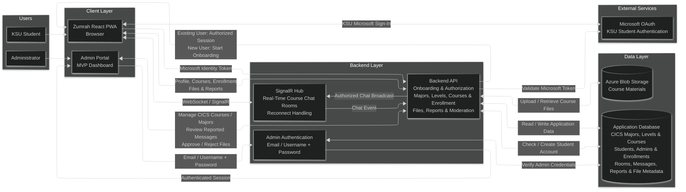

```mermaid
---
config:
  theme: dark
  look: neo
  fontFamily: '''Recursive Variable'', sans-serif'
  themeVariables:
    fontFamily: '''Recursive Variable'', sans-serif'
  layout: elk
---
flowchart LR
 subgraph Users["Users"]
        Student["KSU Student"]
        Admin["Administrator"]
  end
 subgraph Clients["Client Layer"]
        PWA["Zumrah React PWA<br>Browser"]
        AdminPortal["Admin Portal<br>MVP Dashboard"]
  end
 subgraph Backend["Backend Layer"]
        API["Backend API<br>Onboarding &amp; Authorization<br>Majors, Levels, Courses &amp; Enrollment<br>Files, Reports &amp; Moderation"]
        SignalR["SignalR Hub<br>Real-Time Course Chat Rooms<br>Reconnect Handling"]
        AdminAuth["Admin Authentication<br>Email / Username + Password"]
  end
 subgraph Data["Data Layer"]
        Database[("Application Database<br>CICS Majors, Levels &amp; Courses<br>Students, Admins &amp; Enrollments<br>Rooms, Messages, Reports &amp; File Metadata")]
        BlobStorage[("Azure Blob Storage<br>Course Materials")]
  end
 subgraph External["External Services"]
        Microsoft["Microsoft OAuth<br>KSU Student Authentication"]
  end
    Student --> PWA
    Admin --> AdminPortal
    PWA <-- "KSU Microsoft Sign-In" --> Microsoft
    PWA -- Microsoft Identity Token --> API
    API -- Validate Microsoft Token --> Microsoft
    API <-- Check / Create Student Account --> Database
    API -- Existing User: Authorized Session<br>New User: Start Onboarding --> PWA
    AdminPortal -- Email / Username + Password --> AdminAuth
    AdminAuth <-- Verify Admin Credentials --> Database
    AdminAuth -- Authenticated Session --> AdminPortal
    PWA <-- Profile, Courses, Enrollment<br>Files &amp; Reports --> API
    AdminPortal <-- Manage CICS Courses / Majors<br>Review Reported Messages<br>Approve / Reject Files --> API
    PWA <-- WebSocket / SignalR --> SignalR
    SignalR -- Chat Event --> API
    API -- Authorized Chat Broadcast --> SignalR
    API <-- Read / Write Application Data --> Database
    API <-- Upload / Retrieve Course Files --> BlobStorage
```
