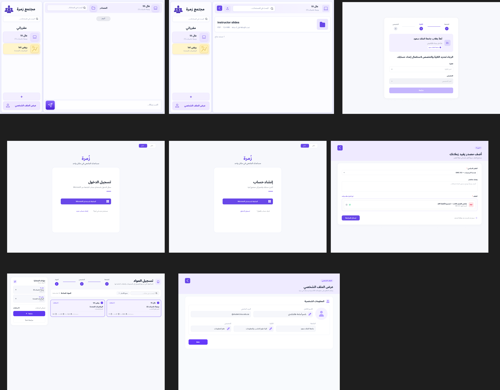

# Zumrah — User Stories and Mockups

**Project:** Zumrah  
**Team:** SAU-0226-Team 9  
**Stage:** Stage 3 — Technical Documentation  
**Scope:** MVP for King Saud University students

## MoSCoW Priority Legend

- **Must Have** — essential for the Zumrah MVP to satisfy its core objectives.
- **Should Have** — important for usability, but the MVP can still function without it.
- **Could Have** — useful enhancement if time allows.
- **Won't Have (MVP)** — intentionally excluded from the current MVP scope.

---

# Must Have

## Student User Stories

### US-01 — Sign In
> As a KSU student, I want to sign in with my university account, so that I can securely access Zumrah.

### US-02 — Create an Account
> As a new KSU student, I want to create my Zumrah account using my university account, so that I can start using the platform.

### US-03 — Complete Onboarding
> As a new student, I want to choose my college and major, so that Zumrah can show me the courses and community relevant to me.

### US-04 — Browse Available Courses
> As a student, I want to browse the courses offered to my major, so that I can find the courses I am taking.

### US-05 — Enroll in a Course
> As a student, I want to add a course to my courses, so that I can access its chat and approved course materials.

### US-06 — Leave a Course
> As a student, I want to remove a course from my courses, so that courses I am no longer taking do not remain in my account.

### US-07 — View My Courses
> As a student, I want to view the courses I have joined, so that I can quickly access their communities and materials.

### US-08 — Access My Major Community
> As a student, I want to access the general community for my major, so that I can communicate with other students in the same major.

### US-09 — Access a Course Chat
> As a student, I want to open the chat for a course I joined, so that I can discuss the course with other enrolled students.

### US-10 — Send a Message
> As a student, I want to send text messages in communities I have access to, so that I can ask questions and participate in discussions.

### US-11 — View Course Materials
> As a student, I want to view approved materials for a course I joined, so that I can find useful study resources in one place.

### US-12 — Download Course Materials
> As a student, I want to download approved course materials, so that I can use them while studying.

### US-13 — Upload Course Materials
> As a student, I want to upload useful materials to a course I joined, so that other students can benefit from them after administrator approval.

### US-14 — Report a Message
> As a student, I want to report an inappropriate message, so that an administrator can review it and take action when necessary.

### US-15 — Install Zumrah
> As a student, I want to add Zumrah to my home screen, so that I can access it easily like an installed application.

## Administrator User Stories

### US-16 — Admin Sign In
> As an administrator, I want to sign in to the Admin Portal, so that I can manage and moderate Zumrah.

### US-17 — Manage Colleges
> As an administrator, I want to manage colleges, so that the university structure represented in Zumrah remains accurate.

### US-18 — Manage Majors
> As an administrator, I want to manage majors within colleges, so that students can select the correct major during onboarding.

### US-19 — Manage Courses
> As an administrator, I want to manage courses, so that students can find the correct courses on Zumrah.

### US-20 — Assign Courses to Majors
> As an administrator, I want to associate courses with the majors that offer them, so that students only see courses relevant to their major.

### US-21 — Review Uploaded Materials
> As an administrator, I want to review student-uploaded course materials, so that I can decide whether they are appropriate for other students.

### US-22 — Approve or Reject Materials
> As an administrator, I want to approve or reject uploaded course materials, so that only appropriate resources become available to students.

### US-23 — Review Reported Messages
> As an administrator, I want to review reported messages and their report details, so that I can determine whether moderation is required.

### US-24 — Dismiss a Report
> As an administrator, I want to dismiss a report when no action is required, so that resolved reports no longer remain pending.

### US-25 — Remove a Reported Message
> As an administrator, I want to remove a reported message when it violates platform rules, so that inappropriate content is no longer visible to students.

---

# Should Have

### US-26 — View My Profile
> As a student, I want to view my profile information, so that I can confirm my account and academic information.

### US-27 — Search Course Materials
> As a student, I want to search course materials by file name, so that I can quickly find the resource I need.

---

# Could Have

No additional features are currently classified as **Could Have**. We are intentionally keeping the MVP focused on its core communication, course material, moderation, and administration workflows.

---

# Won't Have — Current MVP

The following user stories are intentionally outside the current MVP scope.

### WH-01 — Reply to a Message
> As a student, I want to reply directly to a message, so that I can respond to a specific point in a conversation.

### WH-02 — React to a Message
> As a student, I want to react to messages, so that I can respond quickly without sending another message.

### WH-03 — Send Chat Attachments
> As a student, I want to attach files or images directly to chat messages, so that I can share content inside a conversation.

### WH-04 — Edit a Sent Message
> As a student, I want to edit a message after sending it, so that I can correct mistakes.

### WH-05 — Use a Native Mobile Application
> As a student, I want to use a native iOS or Android application, so that I can access Zumrah as a platform-specific mobile app.

### WH-06 — Use Teacher or Tutor Accounts
> As a teacher or tutor, I want to participate using a dedicated role, so that I can interact with students through Zumrah.

### WH-07 — Filter Courses by Academic Level
> As a student, I want courses to be filtered by academic level, so that I only see courses associated with my current level.

---

# Mockups

The main student-facing MVP screens have been designed in Figma. The current mockups cover the following flows:

1. **Sign In** — university-account sign-in screen.
2. **Create Account** — new-account entry screen.
3. **Onboarding / Academic Information** — college and major selection.
4. **Course Registration** — browsing and selecting courses.
5. **Community / Chat** — course and major community messaging interface.
6. **Course Materials** — viewing available course documents.
7. **Upload Material** — submitting a course file for administrator review.

> **Admin Portal:** The MVP Admin Portal will use a simple, barebones interface. We are prioritizing its required management and moderation functionality over detailed visual styling for the current MVP.
